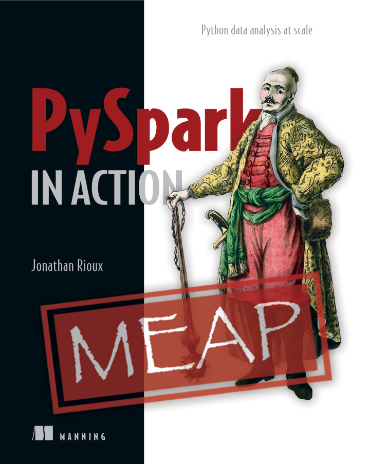
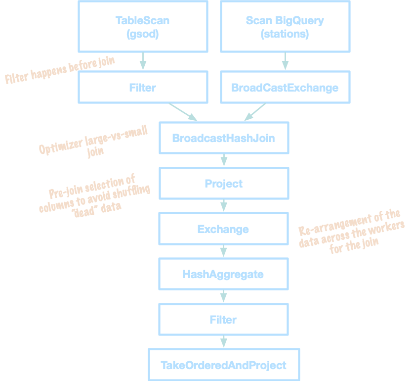
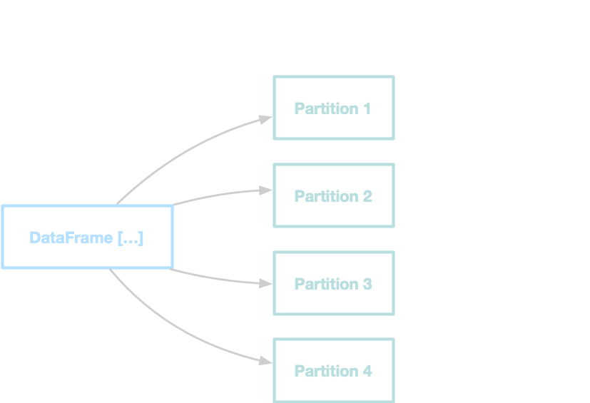
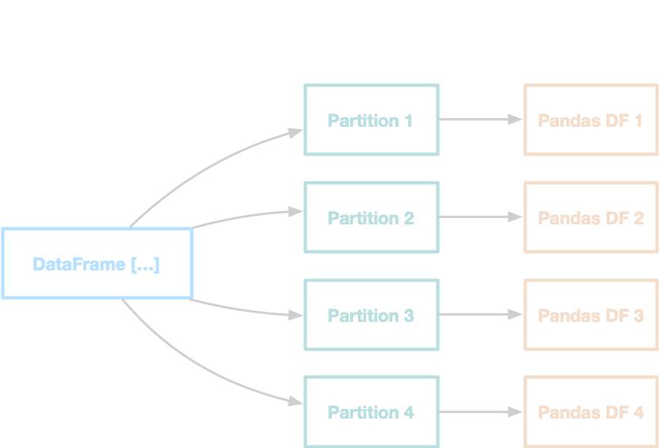
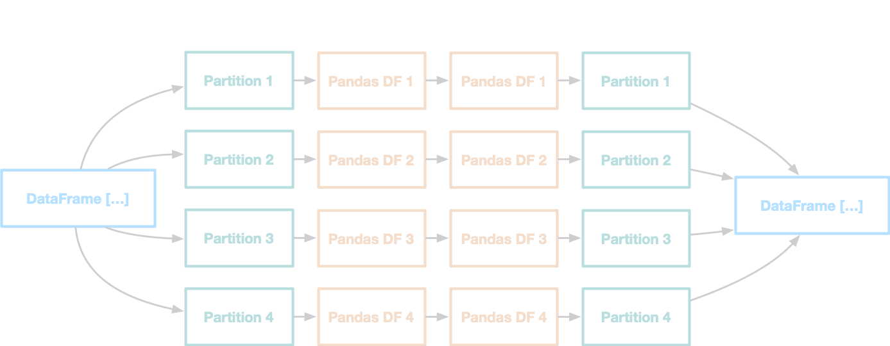
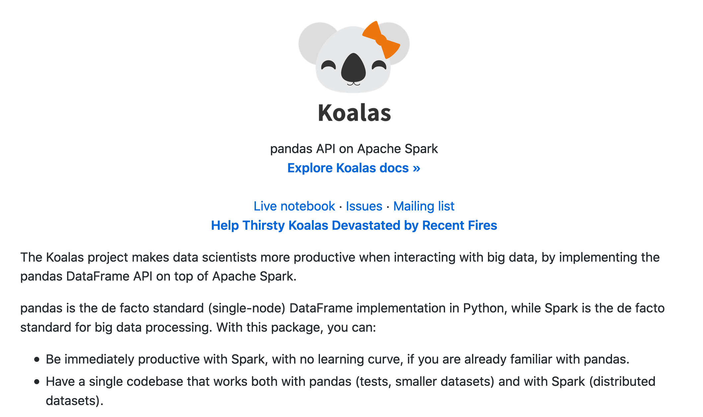

## Getting acquainted with **PySpark** 

---

If you have not filled the Meetup survey, now is the time to do it!

https://forms.gle/6cyWGVY4L4GJvsXh7

(Also copied in the chat)

---

@snap[north-west span-40 text-center]
#### Hi! I'm Jonathan
@snapend

@snap[west span-55]
@ul[list-spaced-bullets text-07]
- Data Scientist, Engineer, Enthusiast
- Head of DS @ EPAM Canada
- Author of PySpark in Action →
- \<3 Spark, \<3 \<3 Python
@ulend
@snapend


@snap[east span-45]

@snapend

---


---


---

### Goals of this presentation

<br />
<br />
@ul[list-spaced-bullets]
- Share my love of (Py)Spark
- Explain where PySpark shines
- Introduce the Python + Spark interop
- Get you excited about using PySpark
- 36,000 ft overview: Managed Spark in the Cloud
@ulend
---

### What I expect from you

<br />
<br />
@ul[list-spaced-bullets]
- You know a little bit of Python
- You know what SQL is
- You won't hesitate to ask questions :-)
@ulend
---

### What is Spark

<br /><br />
*Spark is a unified analytics engine for large-scale data processing*

---

### What is Spark (bis)
<br /><br />
*Spark can be thought of a <ins>data factory</ins> that you (mostly) program like a cohesive computer.*


---?color=linear-gradient(180deg, white 95%, black 5%)

@snap[north span-100 text-black text-16]
Spark under the hood 
@snapend


---?color=linear-gradient(180deg, white 95%, black 5%)

@snap[north span-100 text-black text-16]
Spark as an analytics factory
@snapend


---

## Why is Pyspark **cool**?

---
@snap[north span-100]
### Data manipulation uses the same vocabulary as SQL
@snapend

```python zoom-12
(
my_table
    .select("id", "first_name", "last_name", "age")
    .where(col("age") > 21)
    .groupby("age")
    .count("*")
)
```

@snap[south span-100 text-lightgray text-14]
@[3](`select`)
@[4](`where`)
@[5](`group by`)
@[6](`count`)
@snapend

---

@snap[north span-100]
### I mean, you can legitimately use SQL
@snapend

```python zoom-12
spark.sql("""
    select count(*) from (
        select id, first_name, last_name, age
        from my_table
        where age > 21
        )
    group by age""")
```

---

@snap[north span-100]
### Data manipulation and machine learning with a fluent API
@snapend

```python zoom-12
results = (
    spark.read.text("./data/Ch02/1342-0.txt")
    .select(F.split(F.col("value"), " ").alias("line"))
    .select(F.explode(F.col("line")).alias("word"))
    .select(F.lower(F.col("word")).alias("word"))
    .select(F.regexp_extract(F.col("word"), 
                             "[a-z']*", 0).alias("word"))
    .where(F.col("word") != "")
    .groupby(F.col("word"))
    .count()
)
```

@snap[south span-100 text-lightgray text-14]
@[2](Read a text file)
@[3](Select the column `value`, where each element is splitted (space as a separator). Alias to `line`.)
@[4](Explode each element of `line` into its own record. Alias to `word`.)
@[5](Lower-case each `word`)
@[6-7](Extract only the first group of lower-case letters from each `word`.)
@[8](Keep only the records where the `word` is not the empty string.)
@[9](Group by `word`)
@[10](Count the number of records in each group)
@snapend

---

@snap[north span-100]
### Scala is not the only player in town 
@snapend

@fab[java fa-4x]
&nbsp;&nbsp;
@fab[python fa-4x]
&nbsp;&nbsp;
@fab[r-project fa-4x]
&nbsp;&nbsp;
@fa[database fa-4x]


---

## Let's code!

---

@snap[north span-80]

@snapend

---

@snap[north span-95 text-right text-pink text-06]
### Summoning PySpark
@snapend

```python zoom-10
from pyspark.sql import SparkSession

spark = SparkSession.builder.config(
    "spark.jars.packages",
    ("com.google.cloud.spark:"
     "spark-bigquery-with-dependencies_2.12:0.16.1")
).getOrCreate()
```

@snap[south span-100 text-lightgray text-08]
@[1](A SparkSession is your entry point to distributed data manipulation)
@[3-7](We create our SparkSession with an optional library to access BigQuery as a data source.)
@snapend

---

@snap[north span-95 text-right text-pink text-06]
### Reading data
@snapend

```python zoom-10
from functools import reduce
from pyspark.sql import DataFrame


def read_df_from_bq(year):
    return (
        spark.read.format("bigquery")
        .option("table", f"bigquery-public-data.noaa_gsod.gsod{year}")
        .option("credentialsFile", "bq-key.json")
        .load()
    )


gsod = (
    reduce(
        DataFrame.union, [read_df_from_bq(year) 
                          for year in range(2010, 2020)]
    )
)
```
@snap[south span-100 text-lightgray text-10]
@[5-11](We create a helper function to read our code from BigQuery.)
@[14-19](A `DataFrame` is a regular Python object.)
@snapend
---

@snap[north span-95 text-right text-pink text-06]
### Using the power of the schema
@snapend


```python
 gsod.printSchema()
# root
#  |-- stn: string (nullable = true)
#  |-- wban: string (nullable = true)
#  |-- year: string (nullable = true)
#  |-- mo: string (nullable = true)
#  |-- da: string (nullable = true)
#  |-- temp: double (nullable = true)
#  |-- count_temp: long (nullable = true)
#  |-- dewp: double (nullable = true)
#  |-- count_dewp: long (nullable = true)
#  |-- slp: double (nullable = true)
#  |-- count_slp: long (nullable = true)
#  |-- stp: double (nullable = true)
#  |-- count_stp: long (nullable = true)
#  |-- visib: double (nullable = true)
#  [...]
```
@snap[south span-100 text-lightgray text-10]
@[2-17](The schema will give us the column names and their types.)
@snapend
---

@snap[north span-95 text-right text-pink text-06]
### And showing data
@snapend

```python
gsod = gsod.select("stn", "year", "mo", "da", "temp")

gsod.show(5)

# Approximately 5 seconds waiting
# +------+----+---+---+----+
# |   stn|year| mo| da|temp|
# +------+----+---+---+----+
# |359250|2010| 02| 25|25.2|
# |359250|2010| 05| 25|65.0|
# |386130|2010| 02| 19|35.4|
# |386130|2010| 03| 15|52.2|
# |386130|2010| 01| 21|37.9|
# +------+----+---+---+----+
# only showing top 5 rows
```

---

What happens behind the scenes?


---

@snap[north span-95 text-lightgray text-08]
<br /><br />Any data frame **transformation** will be stored until we need the data.
@snapend


@snap[south span-95 text-lightgray text-08] 
Then, when we trigger an **action**, (Py)Spark will go and optimize the query plan, select the best physical plan and apply the transformation on the data. 

<br /><br />
@snapend 

---

@snap[west span-45 text-lightgray]
#### Transformations
@ul[list-spaced-bullets]
- select
- filter
- group by
- partition
@ulend
@snapend

@snap[east span-45 text-lightgray]
#### Actions
@ul[list-spaced-bullets]
- write
- show
- count
- toPandas
@ulend
@snapend

---
@snap[north span-95 text-right text-pink text-06]
### Something a little more complex
@snapend

```python
import pyspark.sql.functions as F

stations = (
    spark.read.format("bigquery")
    .option("table", f"bigquery-public-data.noaa_gsod.stations")
    .option("credentialsFile", "bq-key.json")
    .load()
)

# We want to get the "hottest Countries" that have at least 60 measures 
answer = (
    gsod.join(stations, gsod["stn"] == stations["usaf"])
    .where(F.col("country").isNotNull())
    .groupBy("country")
    .agg(F.avg("temp").alias("avg_temp"), F.count("*").alias("count"))
).where(F.col("count") > 12 * 5)

answer.orderBy("avg_temp", ascending=False).show(5)
```

@snap[south span-95 text-lightblue text-07]
<br /><br />
read, join, where, groupby, avg/count, where, orderby, show
@snapend

---

@snap[north span-95 text-lightblue text-07]
read, join, where, groupby, avg/count, where, orderby, show
@snapend

@snap[midpoint span-35]

@snapend

---

@snap[north span-95 text-lightblue text-07]
read, join, where, groupby, avg/count, where, orderby, show
@snapend

@snap[midpoint span-50]

@snapend

---

@snap[north span-95 text-right text-pink text-06]
### Python or SQL? 
@snapend

```python
gsod.createTempView("gsod")
stations.createTempView("stations")

spark.sql("""
select country, avg(temp) avg_temp, count(*) count
from gsod 
inner join stations 
on gsod.stn = stations.usaf
where country is not null
group by country
having count > (12 * 5)
order by avg_temp desc
""").show(5)
```
@snap[south span-100 text-lightgray text-10]
@[1-2](We register the data frames as Spark SQL tables.)
@[3-13](We then can query using SQL without leaving Python!)
@snapend

---

@snap[north span-95 text-right text-pink text-06]
### Python and SQL!
@snapend

```python
(
    spark.sql(
        """
    select country, avg(temp) avg_temp, count(*) count
    from gsod 
    inner join stations 
    on gsod.stn = stations.usaf
    group by country"""
    )
    .where("country is not null")
    .where("count > (12 * 5)")
    .orderby("avg_temp", ascending=False)
    .show(5)
)
```

---

<!-- ```python -->
<!-- +-------+-----------------+-----+ -->
<!-- |country|         avg_temp|count| -->
<!-- +-------+-----------------+-----+ -->
<!-- |     DJ|87.09975212464592| 5648| -->
<!-- |     CD|87.04130116040386|23871| -->
<!-- |     SU|85.16865492008482|20772| -->
<!-- |     OD|84.92384937238494|  239| -->
<!-- |     NG|84.82126936840388|55051| -->
<!-- +-------+-----------------+-----+ -->
<!-- only showing top 5 rows -->
<!-- ``` -->
<!-- --- -->


## Python **&rlarr;** Spark

---



---



---

@snap[north span-95 text-right text-pink text-06]
### Scalar UDF
@snapend

```python zoom-10
import pandas as pd
import pyspark.sql.types as T

@F.pandas_udf(T.DoubleType())
def f_to_c(degrees: pd.Series) -> pd.Series:
    """Transforms Farhenheit to Celcius."""
    return (degrees - 32) * 5 / 9
    
f_to_c.func(pd.Series(range(32, 213)))
# 0        0.000000
# 1        0.555556
# 2        1.111111
# 3        1.666667
# 4        2.222222
#           ...
# 176     97.777778
# 177     98.333333
# 178     98.888889
# 179     99.444444
# 180    100.000000
```
@snap[south span-100 text-lightgray text-10]
@[1-2](PySpark types are objects in the `pyspark.sql.types` modules.)
@[4](We promote a regular Python function to a User Defined Function via a decorator.)
@[5-7](A simple function on pandas Series)
@[9](Still unit-testable :-))
@snapend
---

@snap[north span-95 text-right text-pink text-06]
### Scalar UDF
@snapend

```python
gsod = gsod.withColumn("temp_c", f_to_c(F.col("temp")))
gsod.select("temp", "temp_c").distinct().show(5)

# +-----+-------------------+
# | temp|             temp_c|
# +-----+-------------------+
# | 37.2| 2.8888888888888906|
# | 85.9| 29.944444444444443|
# | 53.5| 11.944444444444445|
# | 71.6| 21.999999999999996|
# |-27.6|-33.111111111111114|
# +-----+-------------------+
# only showing top 5 rows
```
@snap[south span-100 text-lightgray text-10]
@[1](A UDF can be used like any PySpark function.)
@snapend
---

@snap[north span-95 text-right text-pink text-06]
### Grouped Map UDF
@snapend

```python
def scale_temperature(temp_by_day: pd.DataFrame) -> pd.DataFrame:
    """Returns a simple normalization of the temperature for a site.

    If the temperature is constant for the whole window, 
    defaults to 0.5.
    """
    temp = temp_by_day.temp
    answer = temp_by_day[["stn", "year", "mo", "da", "temp"]]
    if temp.min() == temp.max():
        return answer.assign(temp_norm=0.5)
    return answer.assign(
        temp_norm=(temp - temp.min()) / (temp.max() - temp.min())
    )
```
@snap[south span-100 text-lightgray text-10]
@[1](A regular, fun, harmless function on (pandas) DataFrames)
@[-]()
@snapend
---

@snap[north span-95 text-right text-pink text-06]
### Grouped Map UDF
@snapend

```python
scale_temp_schema = (
    "stn string, year string, mo string, "
    "da string, temp double, temp_norm double"
)

gsod = gsod.groupby("stn", "year", "mo").applyInPandas(
    scale_temperature, schema=scale_temp_schema
)

gsod.show(5, False)

# +------+----+---+---+----+------------------+
# |stn   |year|mo |da |temp|temp_norm         |
# +------+----+---+---+----+------------------+
# |008268|2010|07 |22 |87.4|0.0               |
# |008268|2010|07 |21 |89.6|1.0               |
# |008401|2011|11 |01 |68.2|0.7960000000000003|
# |008401|2011|11 |14 |65.2|0.6760000000000003|
# |008401|2011|11 |18 |67.9|0.7840000000000004|
# +------+----+---+---+----+------------------+
# only showing top 5 rows
```
@snap[south span-100 text-lightgray text-10]
@[1-4](We provide PySpark the schema we expect our function to return)
@[6-8](We just have to partition (using group), and then `applyInPandas`!)
@[-]()
@snapend

---



---

@snap[north span-95 text-right text-pink text-06]
### You are not limited library-wise
@snapend

```python
from sklearn.linear_model import LinearRegression


@F.pandas_udf(T.DoubleType())
def rate_of_change_temperature(
    day: pd.Series, 
    temp: pd.Series
) -> float:
    """Returns the slope of the daily temperature 
    for a given period of time."""
    return (
        LinearRegression()
        .fit(X=day.astype("int").values.reshape(-1, 1), y=temp)
        .coef_[0]
    )
```

---

```python
result = gsod.groupby("stn", "year", "mo").agg(
    rate_of_change_temperature(gsod["da"], gsod["temp_norm"]).alias(
        "rt_chg_temp"
    )
)

result.show(5, False)
# +------+----+---+---------------------+
# |stn   |year|mo |rt_chg_temp          |
# +------+----+---+---------------------+
# |010250|2018|12 |-0.01014397905759162 |
# |011120|2018|11 |-0.01704736746691528 |
# |011150|2018|10 |-0.013510329829648423|
# |011510|2018|03 |0.020159116598556657 |
# |011800|2018|06 |0.012645501680677372 |
# +------+----+---+---------------------+
# only showing top 5 rows
```

---


---

## Not fan of the syntax?

---?color=linear-gradient(180deg, white 95%, black 5%)



---

@snap[north span-95]
From the README.md
@snapend

```python
import databricks.koalas as ks
import pandas as pd

pdf = pd.DataFrame(
    {
        'x':range(3), 
        'y':['a','b','b'], 
        'z':['a','b','b'],
    }
)

# Create a Koalas DataFrame from pandas DataFrame
df = ks.from_pandas(pdf)

# Rename the columns
df.columns = ['x', 'y', 'z1']

# Do some operations in place:
df['x2'] = df.x * df.x
```

---

## (Py)Spark in the **cloud**

---?color=linear-gradient(180deg, white 95%, black 5%)


---

@snap[north span-95]
### "Serverless" Spark?
@snapend

@snap[west span-45 text-08]
@ul[list-spaced-bullets]
- Cost-effective for sporadic runs
- Scales easily
- Simplified maintenance
@ulend
@snapend

@snap[east span-45 text-08]
@ul[list-spaced-bullets]
- Easy to become expensive
- Sometimes confusing pricing model
- Uneven documentation
@ulend
@snapend

---

## Thank you!

---
